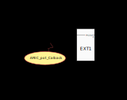
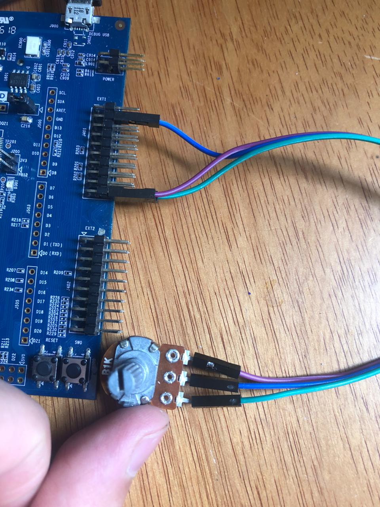
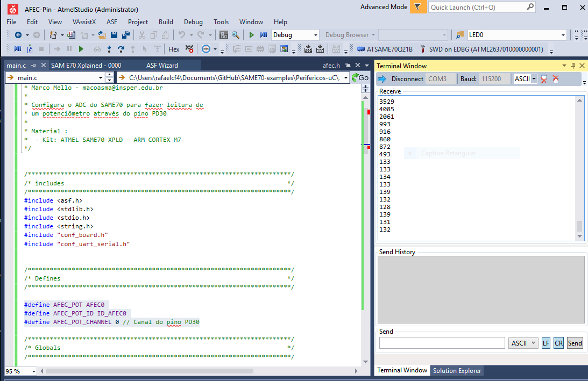
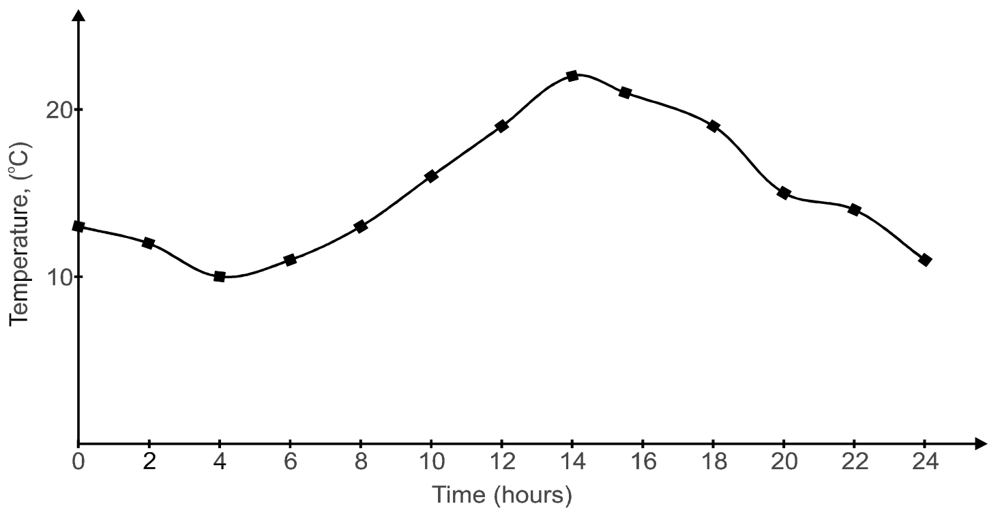
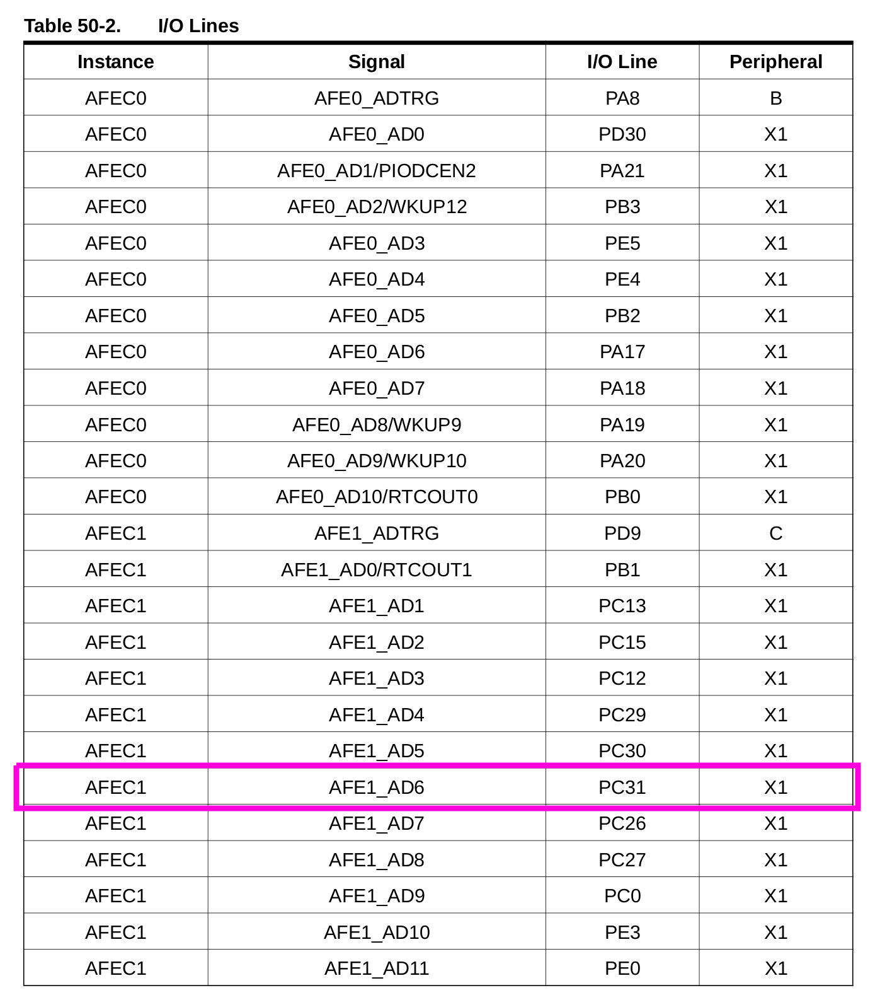

# AFEC - PIN

Esse exemplo efetua a leitura de um potenciômetro e imprime o valor lido na serial.

- Periféricos:
    - AFEC0 - Analog Front-End Controller
    - USART1 (debug - para comunicação com o PC - `stdio` )
    
- Pinos:
    - EXT-1: pin 3
        - `PC31`: AFEC0

- Componentes: 
    
    - SAME70-XPLD
    - 1x Potenciômetro 10k
    - Jumpers

## Diagrama



### conexão



### resultado



## Explicação

``` c
#define AFEC_POT AFEC1
#define AFEC_POT_ID ID_AFEC1
#define AFEC_POT_CHANNEL 6 // Canal do pino PC31
```

No uC utilizado no curso possuímos dois AFEC: AFEC0 e AFEC1. Esses periféricos são responsáveis por digitalizar um valor analógico e transforma em um valor digital. Os AFECs do nosso uC possui resolução de `12` bits (impacta que o valor convertido está entre `0` e `4095`). 

Ao realizar uma conversão analógica digital (ADC), o AFEC necessita realizar uma amostragem do pino (`sample and hold`) e então converter o valor que foi amostrado (`digitalização`). Esse processo é chamado de digitalização:



Similar ao PIO, cada AFEC controla até `12` pinos, porém ele não é capaz de fazer a conversão nesses 12 pinos de forma simultânea, é necessário indicarmos para o periférico qual pino desejamos realizar a conversão.

O AFEC possui o diagrama interno a seguir (simplificado):


> **Note que os pinos do AFEC são analógicos e não digitais como no PIO**

### firmware

O firmware exemplo configura o `AFEC0` canal `0`, esse canal é que está conectado o pino `PC31`, para gerar uma interrupção e chamar a função de `AFEC_pot_Callback()` sempre que um valor novo estiver disponível (conversão finalizada).



A configuração do AFEC só é necessário uma única vez, por isso é realizada fora do `while`

``` c
/* inicializa e configura adc */
config_AFEC_pot(AFEC_POT, AFEC_POT_ID, AFEC_POT_CHANNEL, AFEC_pot_Callback);
```

Uma vez configurado o AFEC, é necessário inicializarmos a conversão, para isso precisamos selecionar o canal e mandar o `AFEC` iniciar a conversão:

``` c
/* Selecina canal e inicializa conversão */
afec_channel_enable(AFEC_POT, AFEC_POT_CHANNEL);
afec_start_software_conversion(AFEC_POT);
```

Uma vez inicializado a conversão, precisamos esperar pela interrupção do AFEC indicando que o valor está pronto, sempre que isso ocorrer a função `AFEC_pot_Callback()` será chamada:

```c
static void AFEC_pot_Callback(void){
  g_ul_value = afec_channel_get_value(AFEC_POT, AFEC_POT_CHANNEL);
  g_is_conversion_done = true;
}
```


O callback indica que o dado está pronto, quando isso ocorrer podemos ir no AFEC e buscar o valor da conversão ADC `afec_channel_get_value()` esse valor é salvo na variável global `g_ul_value` e a falg `g_is_conversion_done` é configurada como `true`.

No nosso `while(1)` do `main`, ficamos verificando esse flag, e quando o valor for verdadeiro imprimimos o valor lido na serial e inicializamos uma nova conversão analógica:

``` c
  while(1){
    if(g_is_conversion_done){
      printf("%d\n", g_ul_value);               
      delay_ms(500);                          
      
      /* Selecina canal e inicializa conversão */
      afec_channel_enable(AFEC_POT, AFEC_POT_CHANNEL);
      afec_start_software_conversion(AFEC_POT);
    }
  }
```

### `config_afec()`

A configuração do AFEC é realizado pela função: `config_AFEC()`, que recebe como parâmetros:

-  `Afec *afec`:  `POT_AFEC` indica qual AFEC será utilizado
    - No nosso caso `AFEC1`
- `uint32_t afec_id`:  `POT_AFEC_ID` ID do afec (para usar no PMC e NVIC)
- `uint32_t afec_channel`: `POT_AFEC_CHANNEL` canal do afec que será realizado a conversão
    - No nosso caso `6`
- `callback` `AFEC_pot_Callback` função a ser chamada quando a conversão estiver pronta.
